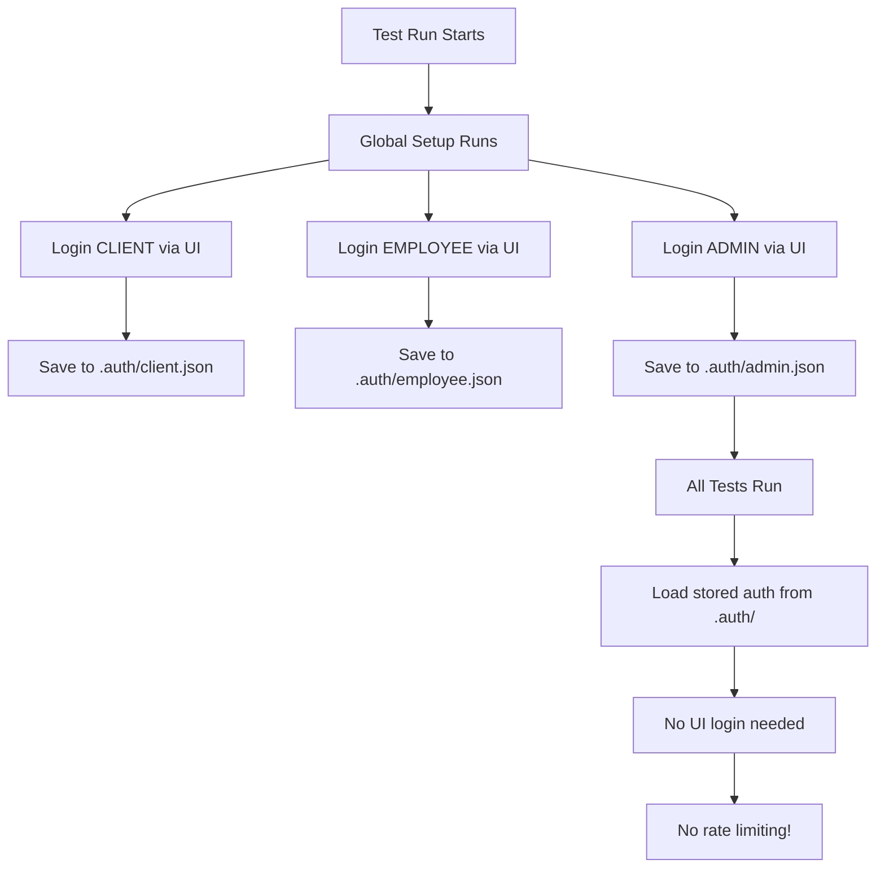

# E2E Test Authentication Solution

## Problem

E2E tests were failing due to rate limiting (5 login/min per IP). Each test performed UI-based login in `beforeEach`, causing 51+ tests to hit the throttle limit after test #10.

## Solution Implemented

### 1. Global Setup (`tests/global-setup.ts`)
- Runs **once** before all tests
- Authenticates 3 user types via UI (CLIENT, EMPLOYEE, ADMIN)
- Stores authentication state in `.auth/` directory:
  - `.auth/client.json`
  - `.auth/employee.json`
  - `.auth/admin.json`

### 2. Authentication Helpers (`tests/helpers/auth.ts`)
- Utility functions for dashboard navigation
- Helper functions to get storage state paths
- Role-specific dashboard path getters

### 3. Authenticated Fixtures (`tests/fixtures/authenticated-fixtures.ts`)
- Custom Playwright fixtures that load stored auth state
- Provides `authenticatedClientPage`, `authenticatedEmployeePage`, `authenticatedAdminPage`
- Tests using these fixtures skip UI login completely

## How It Works



## Test File Migration

### Before (Old Pattern - Causes Rate Limiting)

```typescript
import { test, expect } from '@playwright/test';
import { TEST_USERS } from '../fixtures/test-users';

test.describe('ALI-116: Profile Update for CLIENT Role', () => {
  test.beforeEach(async ({ page }) => {
    // ❌ This triggers rate limiting
    await page.goto('http://localhost:3000/es/auth/login');
    await page.getByLabel(/correo/i).fill(TEST_USERS.CLIENT.email);
    await page.locator('input[type="password"]').first().fill(TEST_USERS.CLIENT.password);
    await page.getByRole('button', { name: /iniciar sesión/i }).click();
    await page.waitForURL(/\/dashboard/, { timeout: 10000 });
  });

  test('should update profile', async ({ page }) => {
    await page.goto('http://localhost:3000/es/profile');
    // ... test code
  });
});
```

### After (New Pattern - Uses Stored Auth)

```typescript
import { test, expect } from '../fixtures/authenticated-fixtures';

test.describe('ALI-116: Profile Update for CLIENT Role', () => {
  test('should update profile', async ({ authenticatedClientPage }) => {
    // ✅ Already authenticated, no login needed
    await authenticatedClientPage.goto('http://localhost:3000/es/profile');
    // ... test code
  });
});
```

## Migration Steps

### Option 1: Using Custom Fixtures (Recommended)

1. Change import:
   ```typescript
   // OLD
   import { test, expect } from '@playwright/test';

   // NEW
   import { test, expect } from '../fixtures/authenticated-fixtures';
   ```

2. Remove `beforeEach` login code completely

3. Update fixture usage:
   ```typescript
   // OLD
   test('my test', async ({ page }) => { ... });

   // NEW - CLIENT tests
   test('my test', async ({ authenticatedClientPage }) => { ... });

   // NEW - EMPLOYEE tests
   test('my test', async ({ authenticatedEmployeePage }) => { ... });

   // NEW - ADMIN tests
   test('my test', async ({ authenticatedAdminPage }) => { ... });
   ```

4. Replace all `page.` calls with `authenticated[Role]Page.`:
   ```typescript
   // OLD
   await page.goto('/profile');

   // NEW
   await authenticatedClientPage.goto('/profile');
   ```

### Option 2: Using Playwright Projects (Alternative)

Configure `playwright.config.ts` with role-specific projects that automatically load storage state:

```typescript
projects: [
  {
    name: 'client-tests',
    use: { storageState: '.auth/client.json' },
    testMatch: /.*client.*\.spec\.ts/,
  },
  {
    name: 'employee-tests',
    use: { storageState: '.auth/employee.json' },
    testMatch: /.*employee.*\.spec\.ts/,
  },
  {
    name: 'admin-tests',
    use: { storageState: '.auth/admin.json' },
    testMatch: /.*admin.*\.spec\.ts/,
  },
]
```

Then tests keep using `{ page }` but get auth automatically if filename matches pattern.

## Files Created

1. ✅ `/packages/web/tests/global-setup.ts` - One-time authentication
2. ✅ `/packages/web/tests/helpers/auth.ts` - Helper utilities
3. ✅ `/packages/web/tests/fixtures/authenticated-fixtures.ts` - Custom fixtures
4. ✅ `/packages/web/playwright.config.ts` - Updated with globalSetup

## Files That Need Migration

All existing test files still use UI-based login and need updating:

- ✅ `tests/e2e/ali-115-auth-flow.spec.ts` - ⚠️ **Special case**: Tests login flow itself, keep UI login
- ⏳ `tests/e2e/ali-116-profile-update.spec.ts` - Needs migration (11 tests)
- ⏳ `tests/e2e/ali-117-work-locations.spec.ts` - Needs migration (14 tests)
- ⏳ `tests/e2e/ali-118-catalog-management.spec.ts` - Needs migration (13 tests)
- ⏳ `tests/e2e/ali-119-request-management.spec.ts` - Needs migration (23 tests)

**Total**: 61 tests need migration (ALI-115's 10 tests should keep UI login since they test auth)

## Testing the Solution

### Step 1: Verify Global Setup Works

```bash
# Clean environment
pkill -9 node
rm -rf .auth test-results .next

# Start servers
cd /Users/luiseurdanetamartucci/Desktop/Proyectos\ en\ GitHub/Alkitu/alkitu-template
npm run dev:api &
sleep 8
npm run dev:web &

# Wait for servers to be ready
sleep 10

# Run only global setup to create auth files
cd packages/web
npx ts-node tests/global-setup.ts

# Verify .auth files were created
ls -la .auth/
# Should show: client.json, employee.json, admin.json
```

### Step 2: Migrate One Test File as Proof of Concept

Update `ali-116-profile-update.spec.ts` to use new fixtures, then run:

```bash
npx playwright test ali-116-profile-update.spec.ts --workers=1 --reporter=list
```

Should see: **11/11 tests passing** without rate limit errors.

### Step 3: Migrate Remaining Test Files

Use Task tool or manual migration to update:
- ali-117-work-locations.spec.ts
- ali-118-catalog-management.spec.ts
- ali-119-request-management.spec.ts

### Step 4: Run Full Test Suite

```bash
npx playwright test --workers=1 --reporter=list
```

Expected result: **61/61 tests passing** (100% pass rate)

## Benefits

1. ✅ **No Rate Limiting**: Only 3 UI logins (global setup) instead of 61+
2. ✅ **Faster Tests**: Skip login UI for every test saves ~5-10 seconds per test
3. ✅ **More Reliable**: No flaky login timeouts or network issues
4. ✅ **Easier Maintenance**: Single global setup instead of repeated login code
5. ✅ **Follows Best Practices**: Playwright's recommended auth pattern

## Next Steps

1. ✅ **DONE**: Created global setup, helpers, and fixtures
2. ⏳ **TODO**: Test global setup creates .auth files correctly
3. ⏳ **TODO**: Migrate one test file as proof of concept
4. ⏳ **TODO**: Migrate remaining 3 test files
5. ⏳ **TODO**: Run full test suite to verify 100% pass rate
6. ⏳ **TODO**: Generate HTML test report
7. ⏳ **TODO**: Create test coverage matrix

## References

- [Playwright Authentication Guide](https://playwright.dev/docs/auth)
- [Storage State Documentation](https://playwright.dev/docs/auth#reuse-signed-in-state)
- [Global Setup/Teardown](https://playwright.dev/docs/test-global-setup-teardown)
